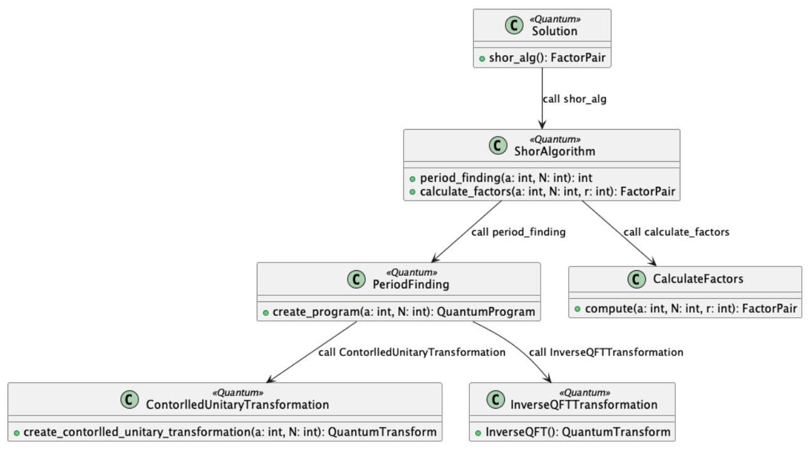

# Example Title

> Short description of the quantum problem and what this example demonstrates.

---

## 📌 Problem Description

Describe the quantum problem being addressed:

- What is the system or scenario?
- What are the key concepts involved?
- Why is this problem relevant?

---

## ⚙️ Implementation

Provide details about the implementation:

- Libraries/frameworks used (e.g., Qiskit, QuTiP)
- Programming language
- How to run the code:

```bash
# example
pip install -r requirements.txt
python main.py
```

---

## 🧠 Modeling Approach

Explain how the system was modeled:

- What approach was used? (UML, QuanUML, custom, etc.)
- What are the main abstractions?
- Why was this approach chosen?

---

## 📊 Diagrams

Include your diagrams in the `/diagrams` folder and reference them here.

Example:



Explain:

- What each component represents
- Key interactions
- Important modeling decisions

---

## 💡 Insights

Discuss what you learned:

- Trade-offs of your modeling approach
- Limitations
- What worked well / what didn’t
- Possible improvements

---

## 📚 References

List relevant materials:

- Papers
- Articles
- Documentation
- Books

---

## 📁 Structure

```text
.
├── README.md
├── diagrams/
├── code/
└── assets/ (optional)
```
